<div align="center">



<br/>

[](https://sathvikloke.github.io)
[](https://landeracl.com)
[](https://www.linkedin.com/in/sathvik-loke)
[](mailto:lokesathvik@gmail.com)

</div>

<br/>

## `signal from biology`

I'm a high schooler at the **Illinois Mathematics and Science Academy** working where biology meets machine learning. Five papers, first author on all five. Two startups. Most of it starts as a random idea at 2am.

The through-line: **take a messy biological signal and pull something decisive out of it.** A knee collapsing under fatigue. A hotspot codon worth correcting. An image a model quietly got worse at.

<table>
<tr>
<td width="33%" valign="top">

### 🧬 Biology
CRISPR guide-RNA prioritization, cell culture, and the parts of sports medicine that are really just physics.

</td>
<td width="33%" valign="top">

### 🧠 Machine learning
Vision-language models on medical imaging, pose estimation from a single camera, evaluation metrics that hold up.

</td>
<td width="33%" valign="top">

### 🛠 Shipping
The connective tissue — pipelines, interfaces, and getting the thing in front of a real coach or clinician.

</td>
</tr>
</table>

---

## `research`

First author on all five.

| | Paper | Venue |
|---|---|---|
| 🧬 | **[Cohort-stratified prioritization of CRISPR–Cas9 sgRNAs for HDR-mediated correction of TP53 hotspot codons in cancer](https://www.biorxiv.org/content/10.64898/2026.05.20.726726v1)**<br/><sub>TP53 is mutated in roughly half of all human cancers. A reproducible pipeline that ranks guides per cancer cohort — ovarian, pancreatic, colorectal — instead of ranking them in the abstract.</sub> | `bioRxiv` |
| 📉 | **[DriftScore: an anchor-relative metric for detecting quality drift in multi-turn multimodal generation](https://openreview.net/pdf?id=S6a4Gg4Z7J)**<br/><sub>Iterative generation degrades output in ways standard no-reference metrics miss. DriftScore measures drift against the original anchor rather than between adjacent turns.</sub> | `EvalMG @ ACM SIGIR 2026` |
| 🧠 | **[Advancing Parkinson's disease management: from dopaminergic therapy to deep brain stimulation and beyond](https://www.journalresearchhs.org/_files/ugd/ebf144_bc660d3935cc4f5597a3bfe3c31d5c48.pdf)**<br/><sub>A narrative review of modern diagnostic and therapeutic strategy, set inside a biological, economic, and psychosocial frame.</sub> | `Journal of Research High School` |
| 🎯 | **[When does prompt-perturbation uncertainty catch interactive-segmentation failures? An empirical study on SAM/MedSAM](https://openreview.net/pdf?id=cLehr9EUAP)**<br/><sub>SAM and MedSAM give clinicians no signal for when to trust a returned mask. Jittering the prompt and measuring disagreement turns out to be the best catastrophic-failure detector on SAM — while medical fine-tuning recalibrates softmax and destroys the mask-quality head.</sub> | `UNSURE @ MICCAI 2026` |
| 🔍 | **[What a slice-level benchmark certifies without the pixels](https://doi.org/10.5281/zenodo.21815040)**<br/><sub>Volumetric scans are labelled one slice at a time, so a score can be inflated by where a slice sits rather than what is in it. Using only four columns every benchmark already publishes — no image data at all — a pixel-blind classifier recovers a median 0.469 of the published margin over chance.</sub> | `Zenodo` |

---

## `building`

| | Project | What it is | |
|---|---|---|---|
| 🦵 | **LANDER** | ACL injury-risk screening from a single phone video of a jump landing. Automates the Landing Error Scoring System, measures knee valgus and flexion, and compares every athlete to their own baseline under fatigue. No lab, no wearables. | [`live`](https://landeracl.com) |
| 🩺 | **Vivantal** | Healthcare has blind spots. Building tools to close the gaps in care. | [`live`](https://vivantal.com) |
| 🌌 | **Portfolio** | Personal site with a point cloud that morphs per route and a live Last.fm feed. React, Vite, hand-rolled canvas — no Three.js. | [`live`](https://sathvikloke.github.io) |

---

## `where the work happens`

```
Colorado State University             Researcher · optimizers in machine learning
Albert Einstein College of Medicine   Researcher · LVLMs and deep learning across medical imaging
University of Illinois Chicago        Research Intern · wet lab, cell culture
Stanford Neuroscience Journal Club    Member · dissecting current research with a remote cohort
Leadership Initiatives, Washington DC Lead Intern · led a team of 3; raised $1,000+ for communities in Nigeria
Angels Grace Hospice / AccentCare     Volunteer · cello for patients in a memory care unit
```

---

## `stack`

<div align="center">


</div>

---

## `competitions`

<div align="center">

| | | |
|:--|:--|:--|
| 🧫 **USABO** | Semifinalist | `2026` |
| 🔢 **AMC 10 / AIME** | 124.5 · 127.5 · 2× Honor Roll · AIME qualifier | |
| 📐 **ICTM** | 2× State qualifier · 11th, Geometry Individual | |
| 🩺 **HOSA** | State Leadership Conference finalist, Medical Innovation | |
| 🤖 **VEX V5RC** | State Round of 16 (2360Z) · Quarterfinalist (355Y) | |

</div>

---

## `telemetry`

<div align="center">


</div>

<!-- NOW-PLAYING:START -->

---

<div align="center">

### `♫ last played`

**Smoke (feat. HVN & SoFaygo)** — Don Toliver

</div>

| recent | artist |
|---|---|
| `Smoke (feat. HVN & SoFaygo)` | Don Toliver |
| `Company Pt 2` | Don Toliver |
| `Way Bigger` | Don Toliver |
| `XSCAPE` | Don Toliver |
| `5X` | Don Toliver |

<sub>Top artists this month — `Ken Carson` · `Don Toliver` · `Lil Uzi Vert` · `NAV` · `Playboi Carti`</sub>

<sub><i>Auto-updated from Last.fm. Scrobbled from Spotify, so it lags a track behind.</i></sub>

<!-- NOW-PLAYING:END -->

---

<div align="center">

### `let's talk`

Collaboration, research, or nothing in particular.

[](mailto:lokesathvik@gmail.com)
[](mailto:sloke@imsa.edu)

<sub><i>biology is a data problem, and most of the signal is still on the floor.</i></sub>

</div>
